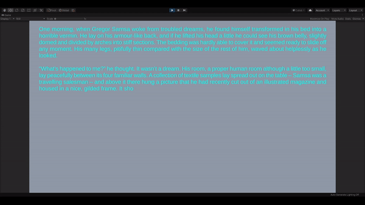
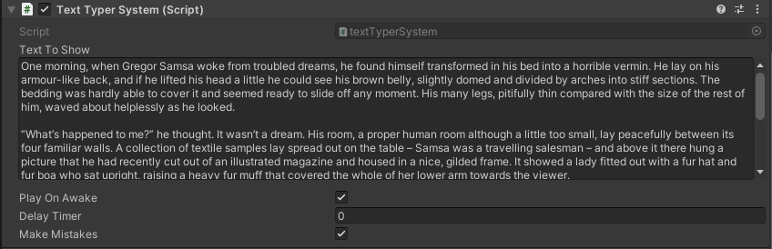

# Unity_TextTyperSystem
A simple system to slowly type a text into a Text UI (or not).

## Example

## How its Looks

## How to Use

This script use TextMeshPRO to work in every text.

Besides that, you will only need [this](Unity_TextTyperSystem/Assets/Scripts/textTyperSystem.cs) script.
